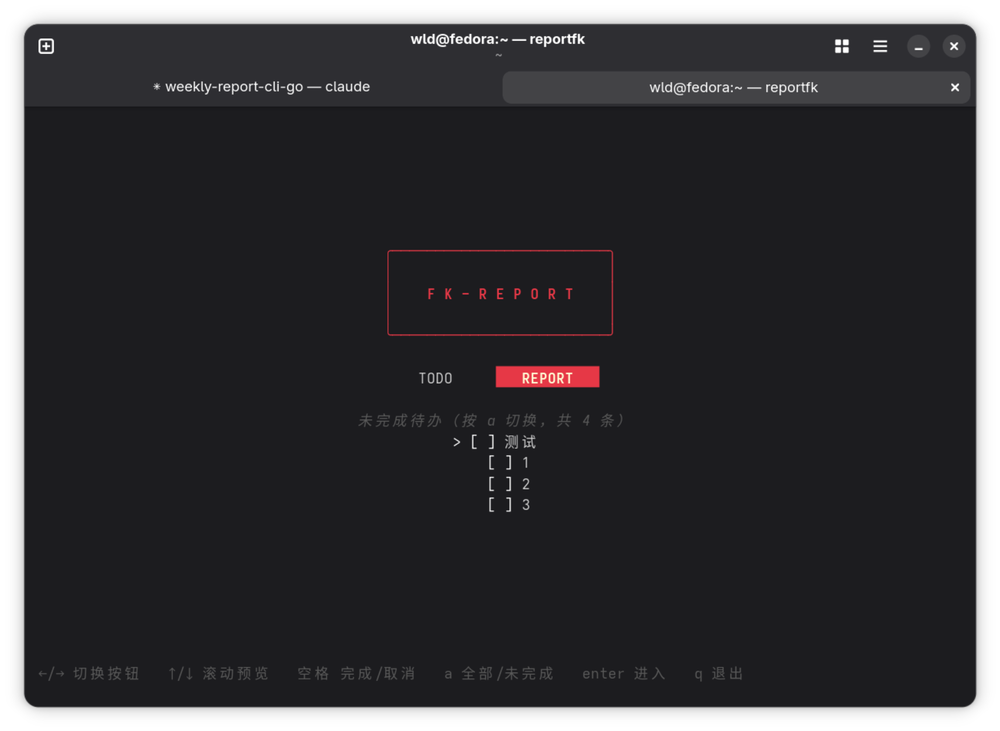
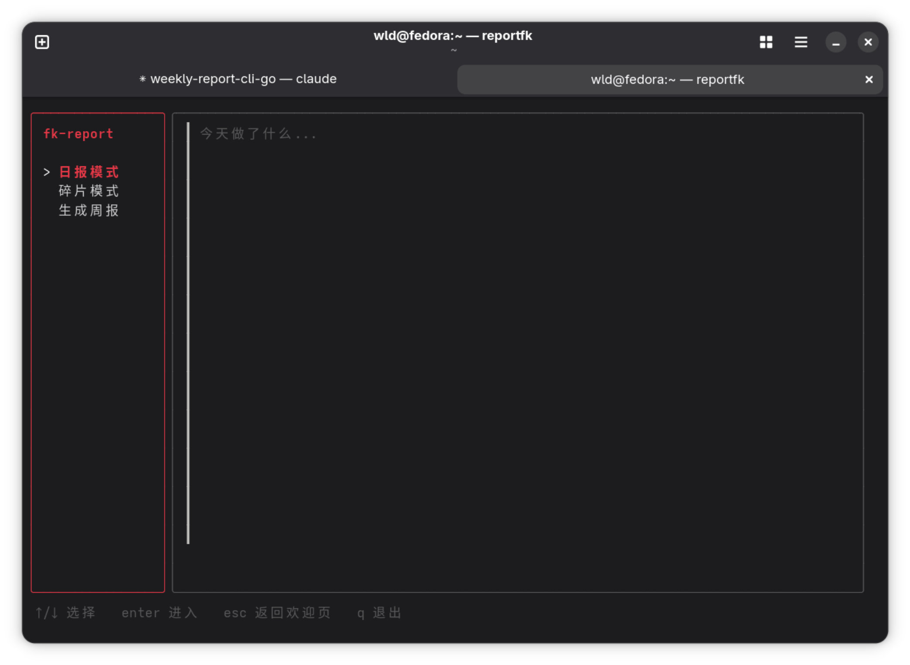

# fuck-report

一个安全运营周报 + 待办的终端 TUI 工具（Go + [Bubble Tea](https://github.com/charmbracelet/bubbletea)）。
主色调为红色，启动后是欢迎页，可以进入 TODO（待办）或 REPORT（日报/碎片/生成周报）两个功能区。
生成周报复用现有 `~/.claude/skills/weekly-report/` skill 的整合润色逻辑。

与 `~/.claude/skills/weekly-report/`（bash 脚本 + cron + skill）是完全独立的两套系统，
互不修改、互不接管，写的是同一批 daily 文件所以数据天然共通。该 skill 的一份静态备份也
存放在本项目的 `skill-backup/weekly-report/` 里（见下文"skill 备份"）。

## 安装

```bash
go build -o ~/.local/bin/reportfk .
```

`~/.local/bin` 需要在 `PATH` 里。之后直接运行：

```bash
reportfk
```

## 功能

### 欢迎页

启动后的第一个画面：顶部是红色的 `F K - R E P O R T` 标题，下方是 `TODO` / `REPORT` 两个
按钮，再下方是一个待办预览区。按钮和预览区可以同时操作、不需要切换焦点：



- `←`/`→` 切换选中 TODO 还是 REPORT 按钮，`enter` 进入对应功能区
- `↑`/`↓` 滚动预览区（一次显示 5 条，默认从未完成待办开始）
- `空格` 直接在预览区里切换选中项的完成状态
- `a` 切换预览区的模式："未完成待办" ⇄ "全部待办"（当前模式和总条数显示在预览区上方）
- `q` / `ctrl+c` 退出程序

### TODO（待办）

进入后是完整的待办列表：

- `↑`/`↓` 选择某一条
- `空格` 切换完成/未完成（完成后文字变灰并加删除线）
- `-` 删除选中的一条
- `=` 进入新增模式，底部出现输入框，输入文字后 `enter` 确认新增、`esc` 取消
- `esc`（非新增模式下）返回欢迎页

待办数据存在 `~/Desktop/weekly_reports/todo.md`，格式是标准 markdown checklist
（`- [ ] 内容` / `- [x] 内容`），每次增删改都会整体覆盖写回这个文件。欢迎页预览区和
TODO 完整页面读写的是同一份数据，互相实时同步。

### REPORT（日报 / 碎片 / 生成周报）



进入后是左侧菜单 + 右侧内容区的三个模式，`↑`/`↓` 选菜单、`enter` 进入、`esc` 返回菜单
（在菜单最外层再按一次 `esc` 回到欢迎页）：

- **日报模式**：右侧直接显示/编辑当天 `~/Desktop/weekly_reports/daily/YYYYMMDD.md` 的
  全文内容，`ctrl+s` 保存（整体覆盖写回）。
- **碎片模式**：上方是当天已记录的碎片历史，下方是单行输入框，输入文字回车后立即以
  `- HH:MM 内容` 追加到同一个 daily 文件末尾。
- **生成周报**：进入后自动调用

  ```bash
  claude -p "生成周报" --permission-mode acceptEdits
  ```

  触发现有 `weekly-report` skill 读取本周全部 daily 文件并整合润色，`fk-report` 本身不做
  任何 AI 调用或文本润色。`--permission-mode acceptEdits` 是必须的——非交互模式下没有人能点
  权限确认弹窗，缺了这个参数 `claude -p` 会静默拒绝写文件，但进程仍然 exit code 0，
  界面会误报"已生成"。

### skill 备份

`skill-backup/weekly-report/` 是 `~/.claude/skills/weekly-report/` 的一份静态快照备份
（`SKILL.md` + 四个 bash 脚本），跟着 `fk-report` 一起纳入 git，纯粹是防丢失/换机器用，
不是活的同步机制——更新原 skill 后需要手动重新复制一份，`fk-report` 运行时也不会读取
这份备份，实际生效的仍然是 `~/.claude/skills/weekly-report/`。

## 项目结构

```
main.go           入口，启动 bubbletea.Program
app.go            根 Model：三级屏幕路由（欢迎页/REPORT/TODO）、菜单导航、布局拼接
welcome_pane.go   欢迎页子 Model（按钮 + 待办预览区）
todo_pane.go      TODO 完整页面子 Model（列表 + 新增输入框）
daily_pane.go     日报模式子 Model（textarea 组件）
fragment_pane.go  碎片模式子 Model（viewport 历史 + textinput 输入框）
report_pane.go    生成周报子 Model（spinner + 调用 claude 子进程）
fsutil.go         纯文件系统操作（daily/todo 的路径规则、读写），不含 UI 逻辑
styles.go         lipgloss 样式集中定义（红色主色调）
skill-backup/     weekly-report skill 的静态备份
```

## 实现原理

`fk-report` 基于 Bubble Tea 的 Elm 架构：状态是一个不可变结构体（Model），所有变化都通过
"消息"（Msg）驱动 `Update` 产生新状态，`View` 只是把当前状态渲染成字符串的纯函数。

### 三级屏幕路由

根 Model（`rootModel`，见 `app.go`）用一个 `screenKind` 枚举做最外层路由：

```go
type screenKind int
const (
	screenWelcome screenKind = iota // 欢迎页
	screenReport                    // 日报/碎片/生成周报（左侧菜单+右侧内容区）
	screenTodo                      // TODO 完整页面
)
```

`rootModel.Update` 按 `screen` 分发到 `updateWelcome`/`updateReport`/`updateTodo` 三个方法；
`screenReport` 内部还有一层过去就有的子路由——`focus`（菜单/内容）+ `active`（当前面板：
日报/碎片/生成周报），沿用最早那版三模式设计。三个屏幕各自决定 `esc` 往哪儿返回：
`screenReport` 菜单层和 `screenTodo` 列表模式下 `esc` 都回到 `screenWelcome`，这是一个
简单的两级导航栈（欢迎页 = 根，其余两个屏幕 = 子屏幕），没有再做通用的"导航历史栈"抽象，
因为只有这两层，用不上。

### 待办数据的共享方式

`todoModel`（`todo_pane.go`）拥有 `items []todoItem` 这个唯一数据源。欢迎页的预览区
（`welcomeModel`）并不持有自己的一份拷贝，而是每次调用时把 `m.todo.items` 当参数传进去：

```go
func (m welcomeModel) Update(msg tea.KeyMsg, items []todoItem) (welcomeModel, tea.Cmd, bool, screenKind)
```

Go 的 slice 在传参时只拷贝"指向底层数组的指针 + 长度 + 容量"这个 header，底层数组是共享的。
所以欢迎页在预览区按空格时执行 `items[idx].done = !items[idx].done`，改的就是
`rootModel.todo.items` 那个数组本身的内存，不需要任何显式同步或写回步骤——这是这份代码里
唯一一处刻意利用 slice 引用语义而不是常规"返回新状态"模式的地方，图的是不用为一份数据搞
两套拷贝再对比合并。持久化仍然走标准的 `tea.Cmd` 异步路径（`persistTodosCmd`），欢迎页和
TODO 完整页面共用同一个持久化函数。

### 组合结构 + 状态机

每个子 Model（`daily`/`fragment`/`report`/`todo`/`welcome`）各自实现自己的 Update/View，
根 Model 负责路由消息、拼接布局——这是 Bubble Tea 里管理多面板 UI 的标准组合模式。
`screenReport` 内部用两个枚举控制键盘输入归属：

```go
type focusArea int  // focusMenu / focusContent —— 键盘输入现在归谁管
type paneKind  int  // paneDaily / paneFragment / paneReport —— 右侧显示哪个面板
```

`focus == focusMenu` 时 `↑`/`↓`/`enter`/`q`/`esc` 由根 Model 直接处理；`focus == focusContent` 时根 Model 只拦截 `esc`，其余按键转发给 `active` 对应的子 Model——所以在
日报模式里打字不会误触发全局的 `q` 退出。`screenTodo` 用类似的 `todoUIMode`
（列表模式/新增模式）做同样的事：新增模式下 `q` 会被当成普通字符输入到文本框，而不是退出。

### 消息驱动的异步操作

`tea.Cmd` 本质是 `func() tea.Msg`：一个返回消息的函数，框架在独立 goroutine 里执行它，
执行完把返回值重新塞回 `Update`。所有耗时操作都走这条路径：读 daily 文件、写 daily 文件、
读/写 todo.md、调用 `claude -p` 生成周报。根 Model 的 `Update` 里，非按键消息（`default`
分支）会**无条件广播给全部子面板**而不只是当前激活的那个——这就是为什么切到别的屏幕后，
周报生成的 spinner 还能在后台继续转、待办的持久化结果还能正确回填状态提示。

### 各面板的具体实现

- **日报模式**：套用 bubbles 的 `textarea.Model`（多行可编辑文本框），`ctrl+s` 把
  `Value()` 整体写回文件——是覆盖式保存，不是增量的。
- **碎片模式**：`viewport.Model`（只读可滚动展示区）+ `textinput.Model`（单行输入框）。
- **TODO**：纯手写的列表 + 光标（没有用 bubbles/list，待办数据结构和交互都很简单，
  引入那套 delegate/filter 机制反而增加复杂度），新增时复用 `textinput.Model`。
- **欢迎页预览区**：同样是手写的窗口滚动列表（固定窗口 5 条），维护一个 `cursor` +
  `offset`，`clamp()` 负责在光标移出可见窗口时挪动 `offset`——本质上是简化版的
  viewport，没引入 `bubbles/viewport` 是因为这里还需要按"未完成/全部"过滤原始数据、
  同时把过滤后的下标映射回原始数组，用viewport 现成的滚动能力反而不够灵活。
- **生成周报**：`spinner.Model` 负责转圈动画，配合 `exec.Command` 调用 `claude -p`。

### 文件系统层完全独立

`fsutil.go` 不依赖任何 bubbletea 类型，纯粹是路径拼接和文件读写：daily 文件相关
（`dailyDir`、`ensureDailyFile`、`appendFragment`、`fragmentLines`）和 todo 文件相关
（`todoFile`、`readTodos`、`writeTodos`）分开两组函数，共享同一个 `weeklyReportsRoot()`
根路径。

## 移植到 opencode 方不方便

**方便，改动面很小，但有一处未经验证的风险点。**

`claude` 是唯一硬编码的外部依赖，且只出现在一个地方：`report_pane.go` 的 `runReportCmd()`
函数里那一行 `exec.Command("claude", "-p", "生成周报", "--permission-mode", "acceptEdits")`。
其余所有文件（包括新增的 `welcome_pane.go`、`todo_pane.go`）完全不知道"claude"这个词的
存在，纯粹是文件读写和 TUI 渲染。所以理论上移植只需要改这一个函数，把命令换成 opencode
的等价调用（参考 `skill-backup/weekly-report/weekly-auto-generate-opencode.sh` 里的
`opencode run "生成周报"`）。

**风险点**：`claude -p` 这条路径踩过一个坑——非交互模式下没有人能点权限确认弹窗，缺了
`--permission-mode acceptEdits` 会静默拒绝写文件但 exit code 仍是 0。opencode 有没有
等价的"非交互模式自动放行文件写入"参数、以及被拒绝时的输出长什么样，这台机器上没装
opencode，没法实测确认。改造时至少要重新验证一遍这条链路，不能假设行为和 claude 一致。

另外这只是 `fk-report` 这个壳的移植成本；"生成周报"背后读取 daily 文件、整合润色的具体
步骤，是写在 `~/.claude/skills/weekly-report/SKILL.md` 里、由 Claude Code 的 skill 机制
加载的，opencode 能不能读到同一份指令、要不要单独给 opencode 准备一份等价的 prompt/配置，
是另一个不在 `fk-report` 这个项目范围内、需要单独确认的问题。

## 已知限制

- 仅在 Linux 下验证过；`daily`/`reports`/`todo.md` 路径写死为
  `~/Desktop/weekly_reports/`，与旧 skill 系统保持一致。
- 日报模式的保存是整篇覆盖，不是差异合并——如果你在外部编辑器和 `fk-report` 里同时改
  同一个文件，后保存的会覆盖先保存的。
- TODO 的删除没有二次确认，`-` 按下去立刻生效（待办本来就是个人任务清单，误删的代价
  比日报/周报文件低很多，所以没加确认弹窗）。
